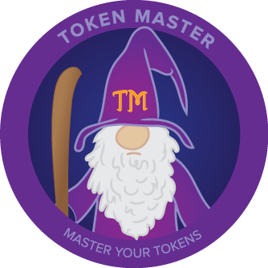

<h1>Token Master</h1>

[](http://github.com/launchpadlab/token_master)
[](http://www.rubydoc.info/gems/token_master)
[](http://inch-ci.org/github/LaunchPadLab/token-master)
[](https://badge.fury.io/rb/token_master)
[](https://travis-ci.org/LaunchPadLab/token-master)
[](https://codeclimate.com/github/LaunchPadLab/token-master/coverage)
[](#license)

Simple token logic for providing (temporary) restricted access.
No routing, views, controllers, or mailers, just logic that you can use wherever and whenever you want.

Tokens can be used for any action that needs the access, such as inviting, confirming, or resetting passwords. These actions can be considered *tokenable actions*.

Tokenable actions can be attributed to any model, not just users. These models then become *tokenable models*.

* [Quick Start](#quick-start)
* [Details](#details)
* [FAQ](#faq)
* [Motivation](#motivation)

## Quick Start

### Installation
Add this line to your application's Gemfile:

`gem 'token_master'`

And then execute:

`$ bundle`

Or install it yourself as:

`$ gem install token_master`

### Usage

##### These examples assume Rails 5, but anything >= 4 will work

Let's say you want to add email confirmation flow to your User. Your **tokenable model** then is the **User** model, and the **tokenable action** might be something like *confirm* (although you can name it anything, as long as you are consistent).

1. Create and run a migration to add the necessary columns to the `users` table like so:
```
bundle exec rails generate token_master User confirm
bundle exec rails db:migrate
```

2. Add the Token Master `token_master` hook to the User class, and pass in the symbol for your *tokenable action*:

```
class User < ApplicationRecord
  token_master :confirm
end
```

3. Somewhere during the signup flow, generate and send the token:

```
class UsersController < ApplicationController

  def create

    # Creating the user is up to you, here is an example
    user = User.create!(
      email: params[:email],
      password: params[:password],
      password_confirmation: params[:password_confirmation]
    )

    # Generate and save a unique token on the new user
    token = user.set_confirm_token!

    # Mark the token as sent
    user.send_confirm_instructions! do
      # Sending the email is up to you, by passing a block here:
      UserMailer.send_confirm(user) # or some other logic
    end
  end

  def resend_confirmation_instructions

    # if you have a 'resend instructions?' flow you can generate a new token and send instructions again in one step
    user.resend_confirm_instructions! do
      # Sending the email is up to you, by passing a block here:
      UserMailer.send_confirm(user) # or some other logic
    end
  end

end
```

4. Somewhere during the confirmation flow, find and confirm the user:

```
class UsersController < ApplicationController
  def confirm

    # finds the user by the token, and mark the token as completed
    user = User.confirm_by_token!(params[:token])

    ...

  end
end
```

## Details

Let's revisit the Quick Start and fill in the details.

### The Generator
When you ran the generator
```
bundle exec rails generate token_master User confirm
```
you provided two arguments:
  * `User` - The class name of the model to which you are adding the *tokenable action*
  * `confirm` - The name of the *tokenable action*

Both of these could be anything, as long as you use the same class and name later on. If you like, you can create multiple *tokenables* at the same time, just add more space-separated *tokenable* names when calling the generator:
```
bundle exec rails generate token_master User confirm invite reset
```

Running the generator does two things:
1. Creates a migration file in `#{Rails.root}/db/migrate` that looks like:

```
class AddConfirmTokenableToUsers < ActiveRecord::Migration[5.0]
  def change
    add_column :users, :confirm_token,        :string,    default: nil
    add_column :users, :confirm_created_at,   :timestamp, default: nil
    add_column :users, :confirm_completed_at, :timestamp, default: nil
    add_column :users, :confirm_sent_at,      :timestamp, default: nil

    add_index :users, :confirm_token
  end
end
```

where the `:users` table is determined from the `User` argument and `:confirm_*` is determined from the `confirm` argument.

2. Creates an initializer `#{Rails.root}/config/initializers/token_master.rb` that looks like:

```
TokenMaster.config do |config|
  # Set up your configurations for each *tokenable* using the methods at the bottom of this file.
  # Example: For `confirm` logic:
  #
  # Default values:
  #   token_lifetime  = 15 # days
  #   required_params = []
  #   token_length    = 20 # characters

  config.add_tokenable_options :confirm,
    token_lifetime:  15, # days
    required_params: [:email],
    token_length:    30 # characters
end
```
The default values will be used unless you configure them otherwise. These options can be set for each *tokenable action*.

### The Model
When you added the Token Master hook and  *tokenable action* to your model
```
class User < ApplicationRecord
  token_master :confirm
end
```
just make sure the class `User` and *tokenable(s)* `:confirm` (this can be multiple tokenables) match what you used in your generator.

Ex.
```
token_master :confirm, :invite, :reset
```

1. The `token_master` hook is included automatically by Token Master in your `ApplicationRecord` base class.

However, if necessary, you can add this yourself by including the following in your class:
```
include TokenMaster::Model
```
This adds the `token_master` class method we used above, and you can make the same calls we described in the `confirm` example above.

2. When you call the `token_master` class method, for each *tokenable action* you provide, a handful of methods are added to the class for each *tokenable action*, and named accordingly.

Assuming the *tokenable action* below is `confirm`, the methods would look like this:

Instance methods
* `set_confirm_token!`
* `send_confirm_instructions!`
* `resend_confirm_instructions!`
* `confirm_status`
* `force_confirm!`

Class methods
* `confirm_by_token!`

In addition to the three you have already seen in action, there is also:

`confirm_status` - returns the current status of the *tokenable action*. This is one of:
* 'no token'
* 'created'
* 'sent'
* 'completed'
* 'expired'

`force_confirm!` - forcibly completes the given *tokenable action*

See the [Api Docs][docs] for more details.

## Advanced
Sometimes in order to redeem a token, we want to make sure some additional information is present and possibly save that to our model.
For example, when implementing a password reset flow, we want to update the User with the new password and make sure it's valid.

Assuming we are using `has_secure_password` or something similar all we need to do is:
1. Configure the *tokenable action* to require these fields when redeeming the token

**../initializers/token_master.rb**
```
TokenMaster.config do |config|
  config.add_tokenable_options :reset_password,
    token_lifetime:  1
    required_params: [:password, :password_confirmation]
    token_length:    30
end
```

2. Include those parameters when redeeming the token (If you don't you will get an error!)
```
User.reset_password_by_token!(
  token,
  password: password,
  password_confirmation: password_confirmation
)
```

Under the hood, Token Master calls `update!` on the model, so if the model is not valid, it won't be saved and the token will not be redeemed.

## FAQ

### Can I use this without Rails?
Yes! However, there is a small dependency on ActiveRecord, see below.

### Can I use this without ActiveRecord?
Almost! There is only a slight dependence on a few ActiveRecord methods and its on our radar to refactor this a bit. In the meantime, a workaround is to make sure the class you are using implements `update`, `update!`, `save`, and `find_by`. In addition, you have to either add Token Master to your class with `include TokenMaster::Model` or use the Token Master core module explicitly:

`TokenMaster::Core.set_token!(User, :confirm)` (which is equivalent to `user.set_confirm_token!(token)`)

See the [Api Docs][docs] for more details.

### Who is Launchpad Lab?
We are product builders, check us out at [Launchpad Lab][lpl//]

## Contributing

Bug reports and pull requests are welcome on GitHub at https://github.com/LaunchpadLab/token-master.

## License

The gem is available as open source under the terms of the [MIT License](http://opensource.org/licenses/MIT).

---------------------------
<!-- Links -->
[devise]: https://github.com/plataformatec/devise
[sorcery]: https://github.com/Sorcery/sorcery
[docs]: http://www.rubydoc.info/gems/token_master
[lpl]: https://launchpadlab.com/
